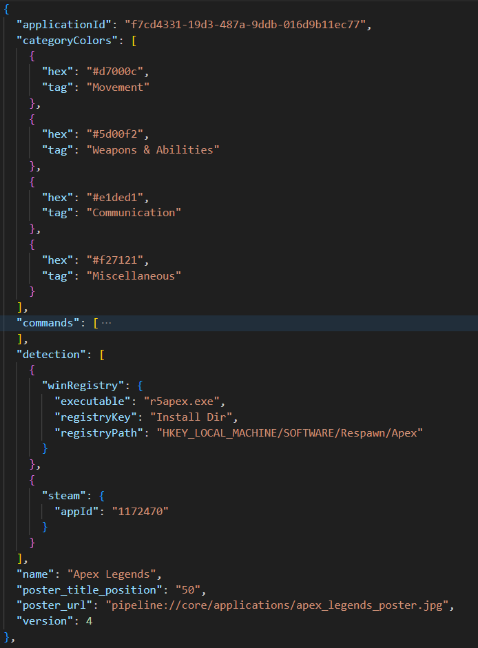
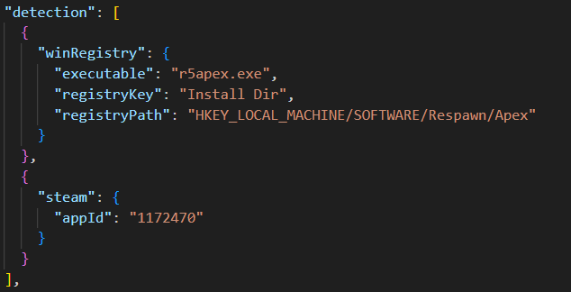
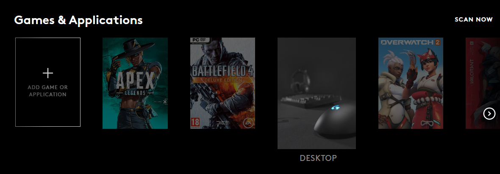

# Fixing Game Detection Issues

G HUB is known to not detect application installations, even if the game is installed and is supported by the software according to the [games list](g-hub-games-list.md).

Some people have suggested this is due to G HUB being installed on a different drive than the game installation. This is *not* the case.

The problem has nothing to do with which drive the game or G HUB is installed on. The real reason is that game detection is specified in a limited, platform-dependent way in G HUB software.

## Solutions
This document will describe two solutions for adding a game that is not being detected properly.
1. [Fixing automatic game detection](#fixing-automatic-game-detection)
2. [Using "Add Game or Application"](#using--add-game-or-application-)

# Fixing automatic game detection
## Background

Game detection information is specified in a file called `applications.json` in G HUB program files. The default location of this file on Windows is `C:\Program Files\LGHUB\data\applications.json`.

The file contains a list of JSON objects, each representing a game, and is necessary for the solution outlined below.

For example, the entry for one game might look like this.



If you notice, there is a key called `"detection"`, that contains platform-dependent information on how to find a game installation.




## The Platforms
The full list of possible platforms is:
```
['steam', 'winRegistry', 'epicGames', 'osxBundle', 'uplay', 'gogGalaxy', 'humbleApp', 'riotGames', 'glob']
```

This following outlines the JSON structure that each platform expects.

Disclaimer: I have not tested all of these options and I do not know for sure that using a given platform will work, especially the more uncommon ones. Finding a working configuration takes research.

### `steam`
If your game is installed through Steam, you're in luck, because almost every game has Steam detection defined and there are an overwhelming number of games that have Steam as their sole detection method. You probably don't even need this guide.

```json_lines
"detection": [
  {
    "steam": {
      "appId": "1172470"
    }
  }
],
```

### `winRegistry`
For Windows users, application install locations are often specified in the Windows Registry, which you can view using Registry Editor.

```json_lines
"detection": [
  {
    "winRegistry": {
      "executable": "itakestwo.exe",
      "registryKey": "Install Dir",
      "registryPath": "HKEY_LOCAL_MACHINE/SOFTWARE/Hazelight/ItTakesTwo"
    }
  }
],
```

### `epicGames`
This is for games installed through Epic Games.

```json_lines
"detection": [
  {
    "epicGames": {
      "appName": "4f0c34d469bb47b2bcf5b377f47ccfe3"
    }
  }
],
```
```json_lines
"detection": [
  {
    "epicGames": {
      "appName": "Flour"
    }
  }
],
```

### `gogGalaxy`
This is for games installed through GOG Galaxy.

```json_lines
"detection": [
  {
    "gogGalaxy": {
      "productId": "1453375253"
    }
  }
],
```

### `uplay`
This is for games installed through Ubisoft Connect.

```json_lines
"detection": [
  {
    "uplay": {
      "appId": "1771"
    }
  }
],
```

### `osxBundle`
Currently only used by ARK: Survival Evolved, ARK: Survival of the Fittest, and World of Warcraft.

```json_lines
"detection": [
  {
    "osxBundle": {
      "bundleId": "com.blizzard.worldofwarcraft",
      "bundlePath": "/Applications/World of Warcraft/World of Warcraft.app"
    }
  },
],
```

### `riotGames`
For games installed through Riot Games.

Currently only used by League of Legends and Valorant.

```json_lines
"detection": [
  {
    "riotGames": {
      "appName": "valorant.live"
    }
  }
],
```

### `humbleApp`
For games installed through the Humble app.

Currently only used by Hollow Knight and Chinatown Detective Agency.

```json_lines
"detection": [
  {
    "humbleApp": {
      "gameName": "hollow_knight_YZt44"
    }
  }
],
```

### `glob`
Currently the only game that uses this solution is Minecraft.

```json_lines
"detection": [
  {
    "glob": "/Applications/Minecraft.app"
  },
  {
    "glob": "/Program Files*/Minecraft/runtime/jre-*/*/bin/javaw.exe"
  }
],
```

## Finding Game IDs and Other Data
Don't know where to find application IDs? This article from [Modding.wiki](https://modding.wiki/en/vortex/developer/game-detection) is a great resource for finding the identifiers required for game detection.


## Example: Adding Game Detection
Let's say that you have installed ___Grand Theft Auto V___ through Epic Games. G HUB is not detecting your game installation, because it is only set to recognize Steam installs of Grand Theft Auto V.

```json_lines
"detection": [
  {
    "steam": {
      "appId": "271590"
    }
  }
],
```

You are using Windows and find a Windows registry key for the game location. According to the `winRegistry` platform format, you change the `"detection"` array in `applications.json` to

```json_lines
"detection": [
  {
    "steam": {
      "appId": "271590"
    }
  },
  {
    "winRegistry": {
      "executable": "GTA5.exe",
      "registryKey": "InstallFolderEpic",
      "registryPath": "HKEY_LOCAL_MACHINE/SOFTWARE/WOW6432Node/Rockstar Games/Grand Theft Auto V"
    }
  }
],
```

Now restart G HUB if it was already running. Navigate to "Games & Applications", and click "Scan Now". Grand Theft Auto V should now be detected.


## Warning About Software Updates
G HUB software updates overwrite `applications.json`, so you will have to re-add your changes after each update.


# Using "Add Game or Application"
Many of you will already know this method, but you can add any file as a game or application by opening the menu to "Games & Applications" and clicking "Add Game or Application".



The reason this method of adding an application may be less desirable to directly modifying `applications.json` is because
* The application won't have a poster picture
* The application's profile won't have any predefined commands
* The application's profile won't have any predefined command categories

It may be better because
* You don't have to fix a file after each software update